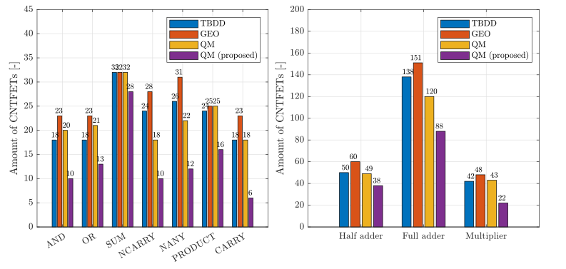

# Ternary logic synthesis (5SIB0 - Electronic Design Automation - Group 4)
The MATLAB algorithms in this folder are used to optimize ternary logic using 3 different techniques. The corresponding paper provides an explanation of the algorithms.
A complex gate can be simulated and directly compared in the corresponding section of the main file.

## Usage
The main file is "Ternary_logic_synthesis.m". This file can be used to run all 3 algorithms.
The output of the algorithms for a single gate can be found by selecting an input gate (options are given in the script),
and subsequently running the section of the desired optimization technique. 
For the Quine-McCluskey algorithm, the choice can be made whether to include the extra optimization steps, as explained in the paper.

## Example output - transistor count
    "Complex gate: "    "HALF-ADDER"

         Method          # of transistors
    _________________    ________________

    "TBDD"                     "56"      
    "GEO"                      "60"      
    "QMC"                      "49"      
    "QMC (optimized)"          "38"      

    "Complex gate: "    "MULTIPLIER"

         Method          # of transistors
    _________________    ________________

    "TBDD"                     "42"      
    "GEO"                      "48"      
    "QMC"                      "43"      
    "QMC (optimized)"          "22"      

    "Complex gate: "    "FULL-ADDER"

         Method          # of transistors
    _________________    ________________

    "TBDD"                    "138"      
    "GEO"                     "151"      
    "QMC"                     "120"      
    "QMC (optimized)"         "88"       

## Example output - Runtime in seconds:
         Method          Half adder    Multiplier    Full adder
    _________________    __________    __________    __________

    "TBDD"               "0.037506"    "0.031968"    "0.038303"
    "GEO"                "0.018237"    "0.01339"     "0.058866"
    "QMC"                "6.8247"      "41.0053"     "6.2624"  
    "QMC (optimized)"    "35.1656"     "214.6474"    "37.9228" 

## Comparison of methods

## Contact

If you have any questions, please contact the developers:

- Robert Bos (r.bos1@student.tue.nl)
- Luuk den Hartog (l.d.hartog@student.tue.nl)
- Tycho Smokers (t.b.a.smokers@student.tue.nl)